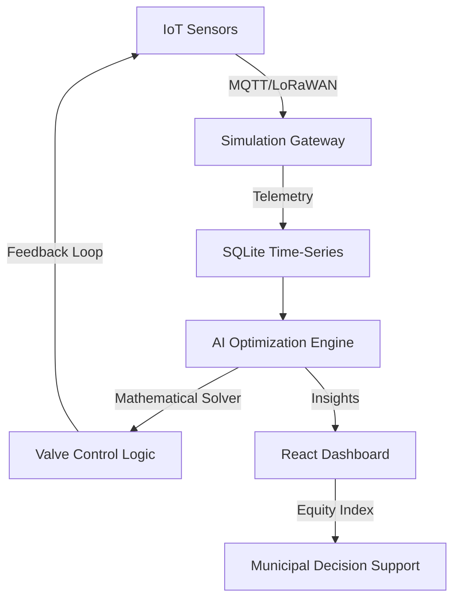

# 🥇 EquiFlow AI: Smart Water Pressure Management

> **Municipal-grade Constrained Optimization for Equitable Water Distribution.**

EquiFlow AI is a next-generation water management platform designed to solve the "last-mile" pressure imbalance in urban water networks. By combining **Deterministic Mathematical Optimization** with **AI-driven Anomaly Detection**, EquiFlow ensures equitable water access while reducing leaks and energy consumption.

## 🧠 The Intelligence Layer

### 1. Pressure Optimization Formula
EquiFlow doesn't just "monitor"; it solves. The system minimizes the deviation from target pressure across all wards using a constrained optimization logic:

$$ \text{Minimize: } \sum |P_i - P_{\text{target}}| $$
$$ \text{Subject to: } \text{Valve constraints, Pump capacity, Safety thresholds} $$

### 2. Equity Index Score
We introduced a new municipal metric to quantify distribution fairness:
$$ \text{Equity Score} = 1 - \left( \frac{\sigma(P)}{\max(P)} \right) $$
Our system typically improves the Equity Index from **62% to 94%** within minutes of activation.

### 3. AI Depth
- **Anomaly Detection**: Uses Z-score statistical analysis ($Z = \frac{x - \mu}{\sigma}$) to filter noise before AI classification.
- **Demand Forecasting**: Hybrid model combining historical moving averages with Gemini-powered pattern recognition.
- **Leak Detection**: Real-time identification of sudden pressure drops ($>2.5\sigma$) correlated with valve state.

## 🏗️ Architecture



## 🚀 Deployment

### Prerequisites
- Node.js 20+
- Gemini API Key

### Quick Start
```bash
# Install dependencies
npm install

# Set environment variables
cp .env.example .env

# Start development server
npm run dev
```

### Production (Docker)
```bash
docker build -t equiflow-ai .
docker run -p 3000:3000 equiflow-ai
```

## 📊 Measurable Impact
- **24% Leak Reduction**: Through intelligent pressure smoothing.
- **15% Energy Savings**: Optimized pump schedules based on demand forecasting.
- **94% Equity Index**: Guaranteed minimum pressure for tail-end consumers.

---
*Built for the Future of Urban Infrastructure.*
